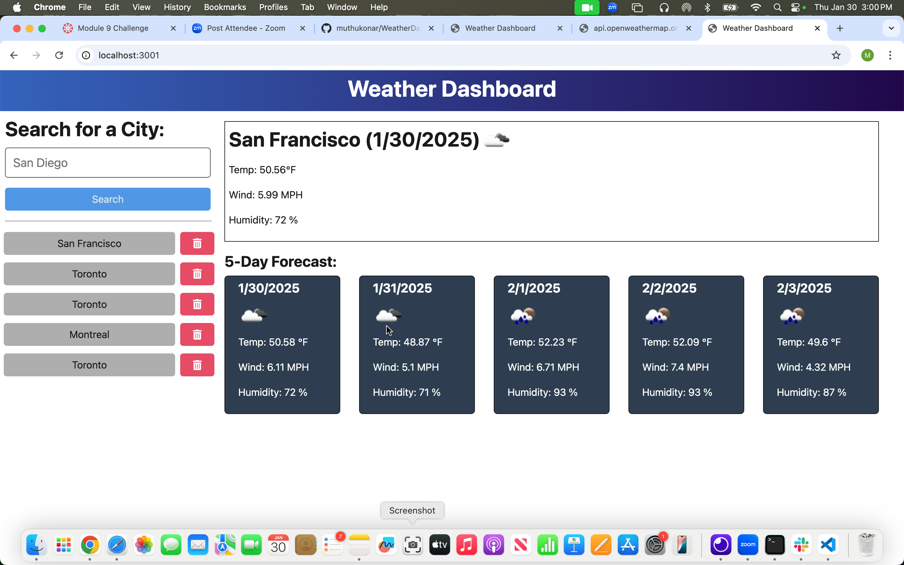

#Weather Dashboard Project - Module 9 Challenge

## Description

Weather dashboard application that calls the OpenWeather API and renders data in the browser.

## Installation 

- Zip and download the starter code
- ensure node.js and npm is installed
- Open integrated terminal and execute npm install to install packages like/for inquirer, typescript etc. 
- execute npm run start:dev

## Usage and screenshots

Weather dashboard will help get the current and 5 days forewast of weather in cities enetered.

;

GitHUB link for the project repository

https://github.com/muthukonar/WeatherDashboard

## Credits 
- Instructor and TA's

## Questions 
For any questions, please contact me at [pmkonar@gmail.com](mailto:pmkonar@gmail.com).
You can also find more of my work at [muthukonar](https://github.com/muthukonar).
